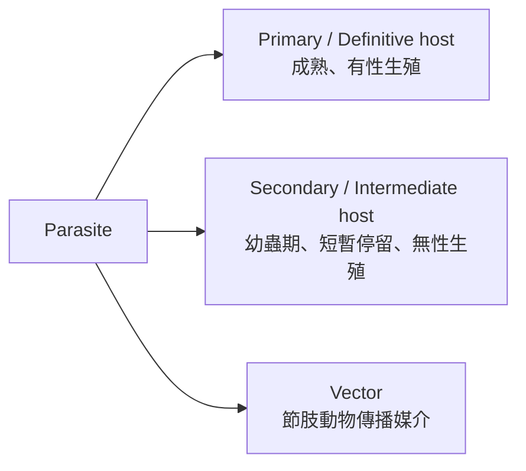
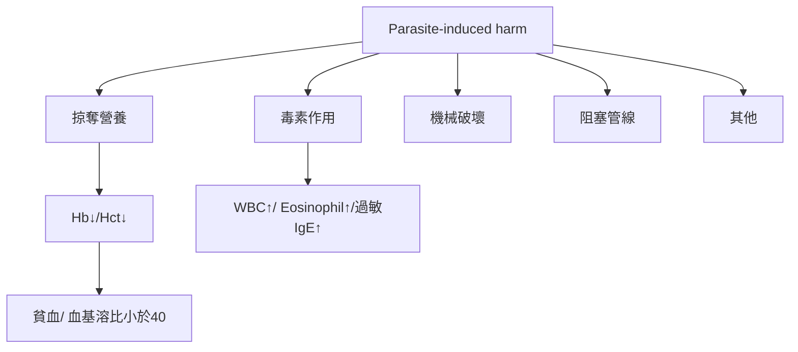
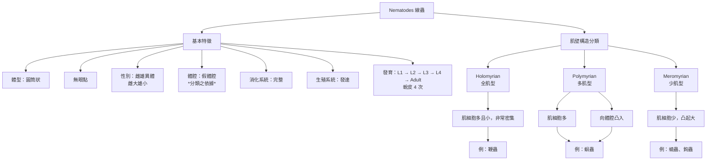
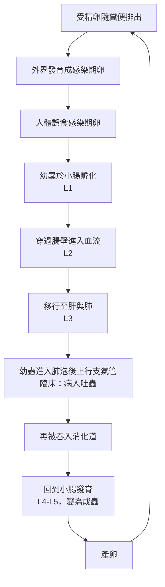
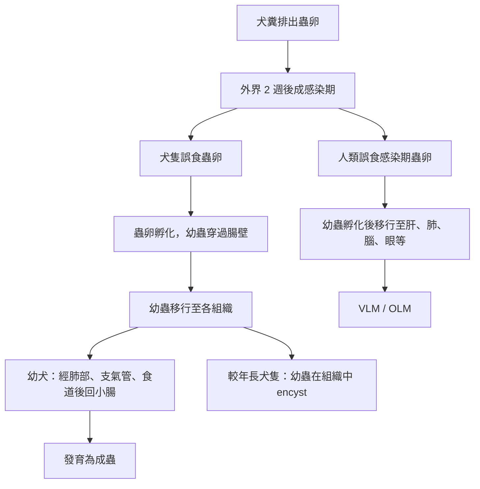

 ## 寄生蟲定義與分類表

| 分類依據 | 類別 | 定義 / 特點 | 例子 |
|----------|------|------------|------|
| 範圍 | 廣義寄生蟲 | 包括動物、植物及部分微生物之寄生現象 | — |
| 範圍 | 狹義寄生蟲 | 通常指寄生於人體或動物體內之寄生蟲 | — |
| 寄生部位 | 體外寄生蟲 (Ectoparasite) | 寄生於宿主體表 | 頭蝨 (*Pediculus humanus capitis*) |
| 寄生部位 | 體內寄生蟲 (Endoparasite) | 寄生於宿主體內 | 衛氏肺吸蟲 (*Paragonimus westermani*) |
| 寄生時間 | 永久寄生蟲 (Permanent parasite) | 一生或長期寄生於宿主 | 衛氏肺吸蟲 |
| 寄生時間 | 暫時寄生蟲 (Temporary parasite) | 僅在特定時間寄生（如吸血） | 蚊子 |
| 生活方式 | 兼性寄生蟲 (Facultative parasite) | 可自由生活，也可在特定條件下寄生 | 鉤蟲 (*Acanthamoeba*) |
| 生活方式 | 專性寄生蟲 (Obligatory parasite) | 必須寄生才能完成生活史 | 衛氏肺吸蟲 (*Paragonimus westermani*) |
| 致病性 | 致病性寄生蟲 | 可引起宿主疾病 | 痢疾阿米巴 (*Entamoeba histolytica*) |
| 致病性 | 非致病性寄生蟲 | 通常不引起明顯疾病 | 大腸阿米巴 (*Entamoeba coli*) |
| 人體寄生部位 | 體腔寄生蟲 (Coelozoic parasite) | 寄生於腔道或體腔內（如腸腔） | 衛氏肺吸蟲 |
| 人體寄生部位 | 皮內寄生蟲 (Intradermal parasite) | 寄生於皮膚內 | 疥蟲 (*Sarcoptes scabiei*) |
| 人體寄生部位 | 細胞寄生蟲 (Cytozoic parasite) | 寄生於宿主細胞內 | 弓蟲 (*Toxoplasma gondii*) |
| 人體寄生部位 | 血液寄生蟲 (Haematozoic parasite) | 寄生於血液或血球中 | 瘧原蟲 (*Plasmodium spp.*) |
| 其他 | 假寄生蟲 (Pseudo-parasite) | 非真正寄生，僅偶然進入體內 | 植物纖維、花粉 |
| 其他 | 偶然寄生蟲 (Incidental parasite) | 非正常宿主，偶然感染人類 | 犬心絲蟲 (*Dirofilaria immitis*) |
| 其他 | 嗜屎性寄生蟲 (Coprozoic parasite) | 與糞便環境相關，常非真正感染 | 糞小桿線蟲 （
*Strongyloides stercoralis*）|


## 宿主分類表

| 類別 | 英文 | 定義 | 相關概念 |
|------|------|------|----------|
| 主要宿主 | Primary host | 寄生蟲在此完成性成熟，具有成蟲，並進行有性生殖，體內具有卵、配子 | Final host（最終宿主）、 Carrier（帶蟲者，帶有病原體但無症狀，仍可傳播）、 Reservoir host（保蟲宿主，帶少量或具傳染力寄生蟲，但本身無明顯症狀）|
| 次要宿主| Secondary host | 寄生蟲在此完成一部分轉換階段（如Larvae階段、無性生殖時期） | Intermediate host（中間宿主）、Paratenic host（保幼宿主，不能夠發育至成蟲，但是能在此宿主體內保持型態，可繼續在食物鏈傳播，例：棘口線蟲、肺吸蟲）|
| 媒介（病媒） | Vector | 傳播寄生蟲或病原體的節肢動物 | 生物性媒介、機械性媒介 |
| 補充：死胡同宿主 | Dead-end host | 寄生蟲無法完成生活史或無法再傳播 | 傳播中斷（如動物性寄生蟲跑到人類身上，人類即為Dead-end host） |



## 傳播途徑表（Route / Mode / Entry）
傳染：在一特定區域和期間內，發生2個或2個以上出現共同症狀的病例

| 傳出途徑 Route | 傳播模式 Mode | 傳入部位（Entry） | 機制重點 | 例子 |
|----------------|--------------|------------------|----------|------|
| Air | Person → person（droplet / airborne） | 呼吸道（口鼻） | 飛沫或氣溶膠進入呼吸道 | 結核、流感 |
| Water | Ova / L1 → Pt. | 腸胃道 | 糞口傳播（污染水源） | *Entamoeba histolytica* |
| Food (Plant/animal products) | Cyst / larva → ingestion | 腸胃道 | 經食物攝入寄生蟲階段 | 絛蟲、肝吸蟲 |
| Soil | Larva → skin penetration | 皮膚 | 土壤中幼蟲主動穿入皮膚 | 鉤蟲 |
| Contact | Direct contact | 皮膚 / 黏膜 | 與感染者或其分泌物接觸 | 疥蟲 |
| Vector | Arthropod bite | 血液 / 組織 | 經節肢動物叮咬傳播 | 瘧疾 |
| Animal (Zoonotic) | Animal → human (various stages) | 口腔 / 皮膚 / 血液 | 動物為來源（非單一固定模式） | 弓蟲 |
| Congenital | Vertical transmission | 血液 / 胎盤 | 母體 → 胎兒 | 先天性弓蟲感染 |

## 病害機轉流程圖



預防：熟食、藥物或治療、媒介/保蟲宿主/中間宿主撲滅、排泄物處理消毒、公衛教育與改善

## 蠕蟲分類表（Helminths）

| 類群 | 特徵 | 代表屬 / 物種 |
|------|------|----------------|
| Nematodes（線蟲） | 體呈圓筒狀，橫切面圓形（roundworm）、<br/>具假體腔（pseudocoelom）、<br/>完整消化系統（有口與肛門）、<br/>雌雄異體（dioecious），雌大雄小。<br/>雌成直線，尾部尖直；<br/>雄尾部彎曲有交尾次或交尾扇 | *Ascaris lumbricoides*, *Trichuris trichiura*, *Ancylostoma duodenale*, *Necator americanus*, *Enterobius vermicularis*, *Strongyloides stercoralis* |
| Cestodes（絛蟲） | 扁平帶狀、<br/>由頭節（scolex）與體節（proglottids）構成、<br/>無消化道（經體表吸收養分）、<br/>多為雌雄同體（hermaphroditic） | *Taenia saginata*, *Taenia solium*, *Echinococcus granulosus* |
| Trematodes（吸蟲） | 葉狀扁平、具兩個吸盤（oral + ventral sucker）、<br/>不完全消化道（無肛門）、<br/>多為雌雄同體（hermaphroditic），<br/>血吸蟲為雌雄異體例外 | *Fasciolopsis buski*, *Clonorchis sinensis*, *Schistosoma spp.* |

## 園蟲（Nematodes）特徵



## Ascaris lumbricoides（蛔蟲）重點表

### 一、基本特徵

| 項目 | 內容 |
|------|------|
| 中文 | 蛔蟲 |
| 學名 | *Ascaris lumbricoides* |
| 感染部位 | 小腸（small intestine） |
| 流行情況 | 全球性，最常見之蠕蟲病<br/>熱帶（rainy season）與衛生條件差地區盛行（亞洲、非洲、南美） |
| 體型 | 成蟲約 15–35 cm，雌蟲較大<br/>為最大型的人類感染nematode |
| 壽命 | 約 1 年 |
| 產卵量 | 成熟雌蟲每日約 20 萬顆卵 → 蟲卵傳播 |
| 外觀 | 乳白、淡褐色；表皮具很細的環狀紋路<br/>口端具三個唇（three lips）；多肌型 （Polymyrian） |
| 性別 | 雌雄異體（dioecious） |

---

### 二、蟲卵分類（診斷重點）

| 類型 | 形態 |
|------|------|
| 受精卵 | 圓形或橢圓形、厚殼、表面具乳頭狀蛋白層（mammillated coat） |
| 非受精卵 | 長橢圓形、較大、殼較薄、內部顆粒狀，內部混濁，不好判定 |

長時間擺放蟲卵，則其無蛋白膜，而是具厚卵殼。

---

### 三、生活史重點

#### Ascaris lumbricoides life cycle (簡化)

```text
Ingestion（蟲卵） → 小腸孵化 → 幼蟲穿腸壁 → 血流 → 肝 → 肺 → 上呼吸道（氣管、咽喉） → 食道 → 吞回小腸（腸道） → 成蟲
```

#### Ascaris lumbricoides life cycle（詳細）



#### 關鍵：

- **肺遷移（lung migration）是症狀來源**
- 感染型態：**embryonated egg（含幼蟲的卵）**

---

### 四、臨床表現

| 時期 | 表現 |
|------|------|
| 幼蟲期（肺） | Löffler syndrome、咳嗽、喘、發燒、嗜酸性球上升（至40%） |
| 成蟲期（腸道） | 多無症狀；腹痛、噁心、營養不良 |
| 嚴重併發症 | 腸阻塞（intestinal obstruction）、膽道阻塞、胰管阻塞 |

---

### 五、診斷、治療、預防

| 項目 | 內容 |
|------|------|
| 診斷 | 糞便顯微鏡檢查（stool microscopy，找蟲卵）|
| 一線治療 | Albendazole 400 mg 單次 |
| 替代治療 | Mebendazole 100 mg bid × 3 days |
| 其他選項 | Ivermectin（較少用於蛔蟲） |
| 預防 | 避免糞口傳染、食物清洗、不生食新鮮蔬菜 |

- **Mebendazole**：阻斷寄生蟲對glucose及其他營養成分的攝取，**阻斷蟲體代謝**。
- **Ivermectin**：藥物結合至 **GluCls** in the membranes of invertebrate **nerve and muscle cell**, **蟲體僵直、死亡**。

---

### 六、考試重點

- 感染型態：**embryonated egg**
- 傳播方式：**fecal–oral**
- 特徵：**三唇（three lips）**
- 生活史關鍵：**lung migration**
- 併發症：**intestinal obstruction（兒童常見）**


## Toxocara canis / Toxocara cati 重點表

### 一、基本特徵

| 項目 | 內容 |
|------|------|
| 種類 | *Toxocara canis*, *Toxocara cati* |
| 地理分布 | Worldwide |
| 終宿主 | Dogs（*T. canis*）、Cats（*T. cati*） |
| 中間宿主 | 無（但可有 paratenic host） |
| 偶然宿主 | Humans（人類為 dead-end host） |
| 高風險族群 | 兒童（特別是有土壤接觸或 pica 行為者） |
| 外觀特徵 | 頸翼（cervical alae）、口部三片唇 |
| 蟲卵 | 厚殼、粗糙表面（pitted / mammillated），類似「高爾夫球」 |
| 感染型態 | Embryonated egg（ 含 L3 larva） |

---

### 二、生活史

```text
Dog/Cat 排出未成熟卵 → 環境中發育成 embryonated egg（L2） → 人類誤食 → 幼蟲孵化 → 穿腸壁 → 全身移行（larva migrans）
```

#### Toxocara canis life cycle 流程圖



#### 關鍵：

- 人類 **不會形成成蟲（dead-end host）**
- 幼蟲停留於組織 → 引發免疫反應（granuloma）

---

### 三、臨床症狀

| 類型 | 內容 |
|------|------|
| 一般症狀 | 發燒、倦怠、腹痛、食慾下降、蕁麻疹、嗜酸性球上升 |
| VLM（Visceral Larva Migrans） | 誤食受精卵入人體，孵化成L2，<br/>幼蟲移行至肝、肺、腦等 → granuloma、hepatosplenomegaly、cough、asthma、wheezing |
| OLM（Ocular Larva Migrans） | 幼蟲進入 retina → 視網膜炎、瘢痕、視網膜剝離、視力喪失（單眼常見） |

---

### 四、診斷與治療

| 項目 | 內容 |
|------|------|
| 動物診斷 | 糞便浮游法（fecal flotation，檢測蟲卵） |
| 人體診斷 | 血清學（ELISA：anti-Toxocara antibody）、嗜酸性球上升、影像（CT / ultrasound） |
| 治療 | Albendazole（首選）、Mebendazole |
| 輔助治療 | 嚴重發炎可使用 corticosteroids |
| 特殊處理 | OLM 可能需手術或雷射治療 |

---

### 五、考點整理

- 感染型態：**embryonated egg（L3）**
- 人類角色：**dead-end host**
- 臨床分類：**VLM vs OLM**
- 典型族群：**兒童 + 土壤暴露**
- 特徵：**golf ball-like egg + cervical alae**