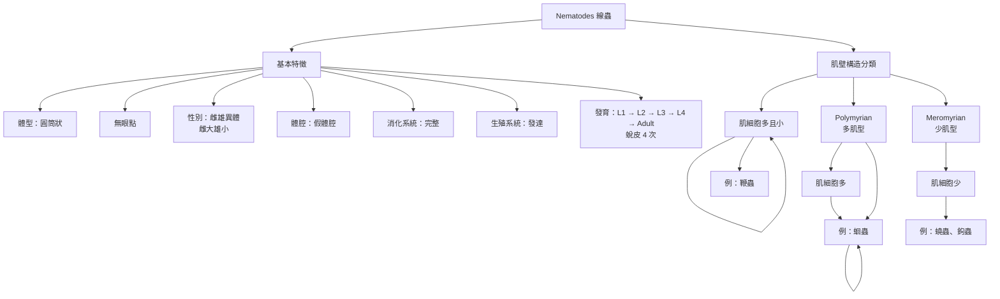

 ## 寄生蟲定義與分類表

| 分類依據 | 類別 | 定義 / 特點 | 例子 |
|----------|------|------------|------|
| 範圍 | 廣義寄生蟲 | 包括動物、植物及部分微生物之寄生現象 | — |
| 範圍 | 狹義寄生蟲 | 通常指寄生於人體或動物體內之寄生蟲 | — |
| 寄生部位 | 體外寄生蟲 (Ectoparasite) | 寄生於宿主體表 | 頭蝨 (*Pediculus humanus capitis*) |
| 寄生部位 | 體內寄生蟲 (Endoparasite) | 寄生於宿主體內 | 衛氏肺吸蟲 (*Paragonimus westermani*) |
| 寄生時間 | 永久寄生蟲 (Permanent parasite) | 一生或長期寄生於宿主 | 衛氏肺吸蟲 |
| 寄生時間 | 暫時寄生蟲 (Temporary parasite) | 僅在特定時間寄生（如吸血） | 蚊子 |
| 生活方式 | 兼性寄生蟲 (Facultative parasite) | 可自由生活，也可在特定條件下寄生 | 鉤蟲 (*Acanthamoeba*) |
| 生活方式 | 專性寄生蟲 (Obligatory parasite) | 必須寄生才能完成生活史 | 衛氏肺吸蟲 (*Paragonimus westermani*) |
| 致病性 | 致病性寄生蟲 | 可引起宿主疾病 | 痢疾阿米巴 (*Entamoeba histolytica*) |
| 致病性 | 非致病性寄生蟲 | 通常不引起明顯疾病 | 大腸阿米巴 (*Entamoeba coli*) |
| 人體寄生部位 | 體腔寄生蟲 (Coelozoic parasite) | 寄生於腔道或體腔內（如腸腔） | 衛氏肺吸蟲 |
| 人體寄生部位 | 皮內寄生蟲 (Intradermal parasite) | 寄生於皮膚內 | 疥蟲 (*Sarcoptes scabiei*) |
| 人體寄生部位 | 細胞寄生蟲 (Cytozoic parasite) | 寄生於宿主細胞內 | 弓蟲 (*Toxoplasma gondii*) |
| 人體寄生部位 | 血液寄生蟲 (Haematozoic parasite) | 寄生於血液或血球中 | 瘧原蟲 (*Plasmodium spp.*) |
| 其他 | 假寄生蟲 (Pseudo-parasite) | 非真正寄生，僅偶然進入體內 | 植物纖維、花粉 |
| 其他 | 偶然寄生蟲 (Incidental parasite) | 非正常宿主，偶然感染人類 | 犬心絲蟲 (*Dirofilaria immitis*) |
| 其他 | 嗜屎性寄生蟲 (Coprozoic parasite) | 與糞便環境相關，常非真正感染 | 糞小桿線蟲 （
*Strongyloides stercoralis*）|

## 宿主分類表

| 類別 | 英文 | 定義 | 相關概念 |
|------|------|------|----------|
| 主要宿主 | Primary host | 寄生蟲在此完成性成熟，具有成蟲，並進行有性生殖，體內具有卵、配子 | Final host（最終宿主）、 Carrier（帶蟲者，帶有病原體但無症狀，仍可傳播）、 Reservoir host（保蟲宿主，帶少量或具傳染力寄生蟲，但本身無明顯症狀）|
| 次要宿主| Secondary host | 寄生蟲在此完成一部分轉換階段（如Larvae階段、無性生殖時期） | Intermediate host（中間宿主）、Paratenic host（保幼宿主，不能夠發育至成蟲，但是能在此宿主體內保持型態，可繼續在食物鏈傳播，例：棘口線蟲、肺吸蟲）|
| 媒介（病媒） | Vector | 傳播寄生蟲或病原體的節肢動物 | 生物性媒介、機械性媒介 |
| 補充：死胡同宿主 | Dead-end host | 寄生蟲無法完成生活史或無法再傳播 | 傳播中斷（如動物性寄生蟲跑到人類身上，人類即為Dead-end host） |

## 傳播途徑表（Route / Mode / Entry）
傳染：在一特定區域和期間內，發生2個或2個以上出現共同症狀的病例

| 傳出途徑 Route | 傳播模式 Mode | 傳入部位（Entry） | 機制重點 | 例子 |
|----------------|--------------|------------------|----------|------|
| Air | Person → person（droplet / airborne） | 呼吸道（口鼻） | 飛沫或氣溶膠進入呼吸道 | 結核、流感 |
| Water | Ova / L1 → Pt. | 腸胃道 | 糞口傳播（污染水源） | *Entamoeba histolytica* |
| Food (Plant/animal products) | Cyst / larva → ingestion | 腸胃道 | 經食物攝入寄生蟲階段 | 絛蟲、肝吸蟲 |
| Soil | Larva → skin penetration | 皮膚 | 土壤中幼蟲主動穿入皮膚 | 鉤蟲 |
| Contact | Direct contact | 皮膚 / 黏膜 | 與感染者或其分泌物接觸 | 疥蟲 |
| Vector | Arthropod bite | 血液 / 組織 | 經節肢動物叮咬傳播 | 瘧疾 |
| Animal (Zoonotic) | Animal → human (various stages) | 口腔 / 皮膚 / 血液 | 動物為來源（非單一固定模式） | 弓蟲 |
| Congenital | Vertical transmission | 血液 / 胎盤 | 母體 → 胎兒 | 先天性弓蟲感染 |

## 蠕蟲分類表（Helminths）

| 類群 | 特徵 | 代表屬 / 物種 |
|------|------|----------------|
| Nematodes（線蟲） | 體呈圓筒狀，橫切面圓形（roundworm）、具假體腔（pseudocoelom）、完整消化系統（有口與肛門）、雌雄異體（dioecious），雌大雄小。雌成直線，尾部尖直；雄尾部彎曲有交尾次或交尾扇 | *Ascaris lumbricoides*, *Trichuris trichiura*, *Ancylostoma duodenale*, *Necator americanus*, *Enterobius vermicularis*, *Strongyloides stercoralis* |
| Cestodes（絛蟲） | 扁平帶狀、由頭節（scolex）與體節（proglottids）構成、無消化道（經體表吸收養分）、多為雌雄同體（hermaphroditic） | *Taenia saginata*, *Taenia solium*, *Echinococcus granulosus* |
| Trematodes（吸蟲） | 葉狀扁平、具兩個吸盤（oral + ventral sucker）、不完全消化道（無肛門）、多為雌雄同體（hermaphroditic），血吸蟲為雌雄異體例外 | *Fasciolopsis buski*, *Clonorchis sinensis*, *Schistosoma spp.* |

## 園蟲（Nematodes）特徵

