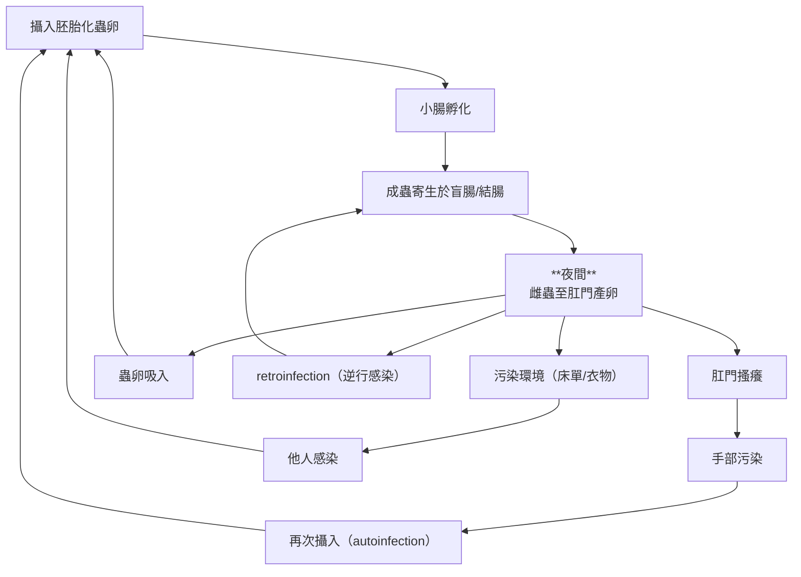
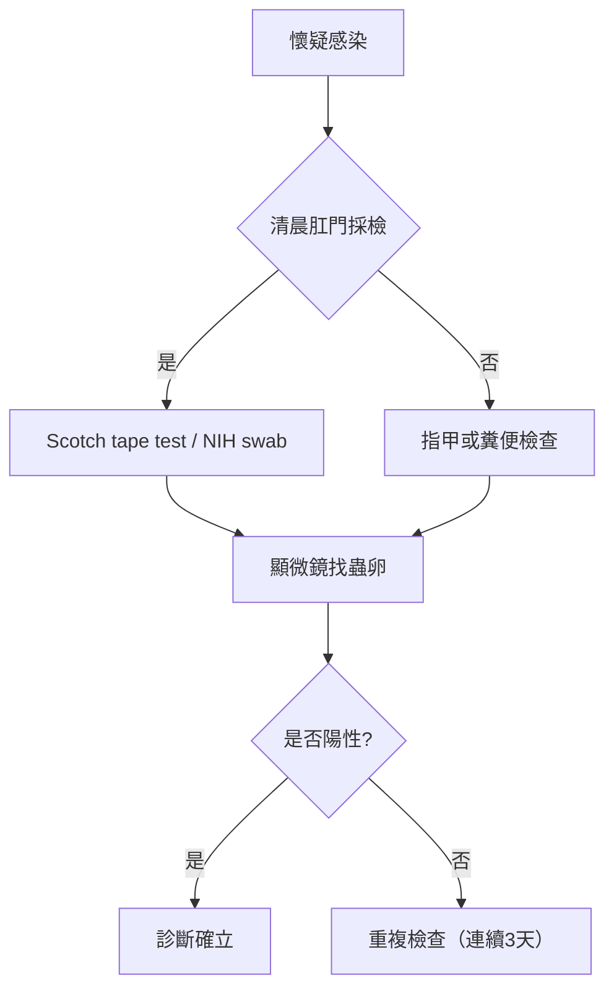
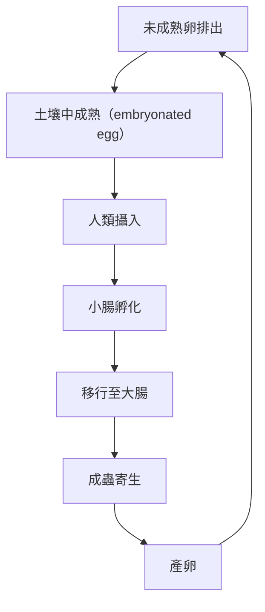
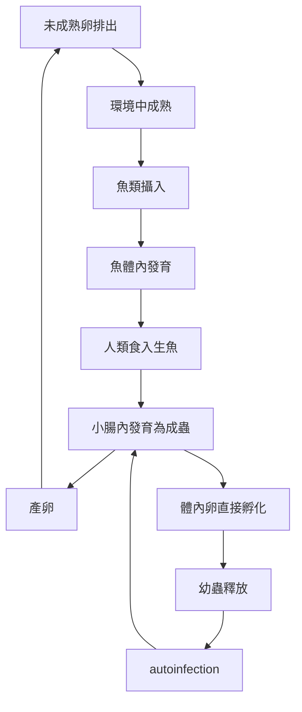
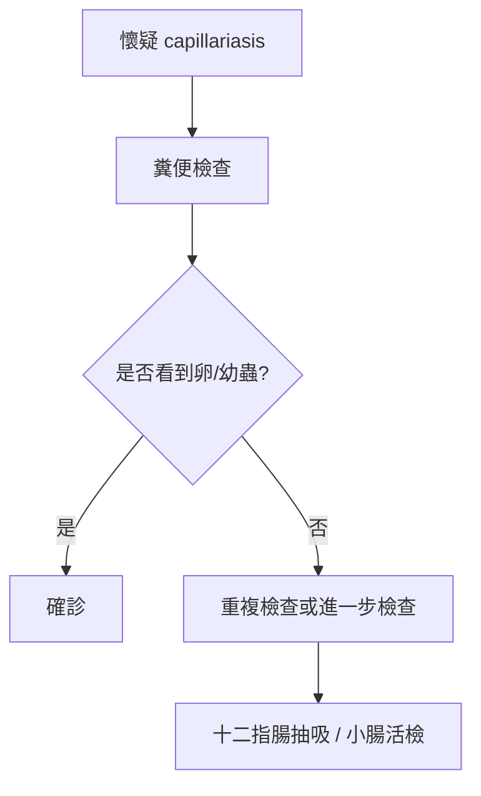
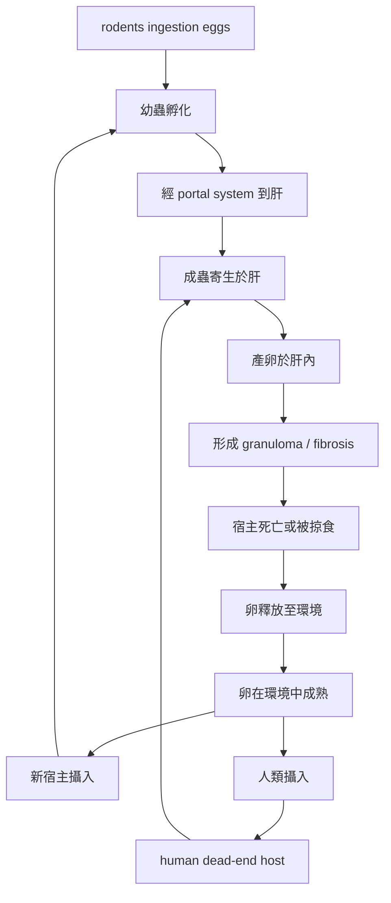
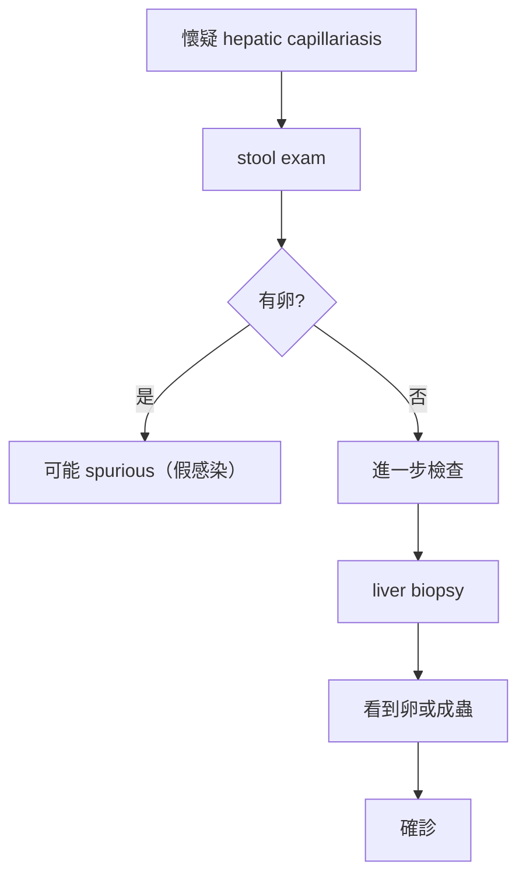

## Enterobius vermicularis（蟯蟲）總整理

---

### 一、基本重點表

| 類別 | 內容 |
|---|---|
| 學名 | *Enterobius vermicularis* |
| 常見名稱 | pinworm / threadworm |
| 自然宿主 | 人（human only） |
| 切片外觀 | 少肌型（meromyrian type）、具cervival alae(體表處有一小spine) |
| 感染期 | Embryonated eggs（胚胎化蟲卵） |
| 感染方式 | 糞口傳播、自體感染（autoinfection, exogenous autoinfection）、吃/吸入蟲卵、逆行性感染（retroinfection, endogenous autoinfection） |
| 好發族群 | 學齡兒童（免疫力不成熟，處在環境人口密度高） |
| 促進感染因子 | 擁擠、衛生差、集體生活（學校、托兒所） |
| 主要症狀 | 肛門搔癢（夜間）、睡眠干擾 |
| 可能併發症 | 陰道炎、輸卵管炎、appendicitis（少見） |
| 診斷 | Scotch tape test（首選）、NIH swab |
| 治療 | Albendazole / Mebendazole / Pyrantel pamoate |
| 預防 | 手部衛生、環境清潔、全家同步治療 |

---

### 二、形態分類表

| 項目 | 雄蟲 Male | 雌蟲 Female | 蟲卵 Ova |
|---|---|---|---|
| 大小 | 約 2–5 mm | 約 8–13 mm | 約 50–60 × 20–30 μm |
| 外形 | 白色、細小 | 白色、尾端細長 | 一側扁平（plano-convex） |
| 尾端 | 彎曲 | 尖直（pin-like） | — |
| 特徵 | 單一交尾刺（copulatory spicule） | 頸翼（cervical alae）、食道球（double bulb esophagus） 明顯 | 薄殼、不對稱 |
| 其他構造 | cervical alae、double bulb esophagus | 同左 | 診斷最重要 |

---

### 三、生活史流程圖



---

### 四、臨床表現分類

| 臨床面向 | 內容 |
|---|---|
| 常見族群 | 兒童 |
| 無症狀比例 | 約 1/3 無症狀 |
| 局部症狀 | 肛門搔癢（pruritus ani）、抓破皮膚 |
| 睡眠影響 | 夜間活動 → 睡眠干擾 |
| 泌尿/生殖道 | 夜尿 (nocturnal enuresis)、陰道刺激 |
| 上行感染 | 盆腔腹膜（chronic pelvic peritonitis）、子宮、輸卵管 (chronic salpingitis) |
| 其他併發症 | 闌尾炎（appendicitis）、UTI（少見） |

---

### 五、診斷流程圖



---

### 六、治療與預防

| 類別 | 內容 |
|---|---|
| Albendazole | 400 mg 單次 |
| Mebendazole | 100 mg 單次 |
| Pyrantel pamoate | 11 mg/kg 單次（max 1 g） |
| 重點 | **2 週後需重複一次** |
| 家庭處理 | 建議全家同步治療 |
| 預防 1 | 勤洗手 |
| 預防 2 | 指甲清潔 |
| 預防 3 | 清洗床單衣物 |

---

### 七、考點整理

- 感染型態：**embryonated egg**
- 特徵：**planoconvex egg（扁一側）**
- 診斷：**Scotch tape test（主要的不是糞便檢查）**
- 症狀：**夜間肛門癢**
- 關鍵機制：**autoinfection + retroinfection**

 
 ## Trichuris trichiura（鞭蟲）總整理

---

### 一、基本重點表

| 類別 | 內容 |
|---|---|
| 學名 | *Trichuris trichiura* |
| 常見名稱 | whipworm |
| 流行病學 | 全球分布，熱帶與衛生差地區常見 |
| 公衛定位 | WHO 三大 soil-transmitted helminths（迴、鞭、鉤） 之一 |
| 體型 | 前 3/5 細長，後 2/5 粗（細端是頭＋食道，粗的那些是腸＋生殖道） |
| 切片外觀 | 全肌型 |
| 感染期 | Embryonated eggs（胚胎化蟲卵） |
| 感染方式 | 糞口傳播（ingestion） |
| 寄生部位 | 盲腸與升結腸（前端插入黏膜） |
| 特徵 | 前細後粗（whip-like），紋細胞（stichosomes，腺體組織：提供酵素、保護食道），nerve ring（收縮、推進食物）|
| 主要症狀 | 輕度多無症狀，吸血0.005ml/day per worm |
| 重症表現 | 痢疾、血便、tenesmus、rectal prolapse |
| 兒童影響 | 貧血、生長遲滯、認知發展受損 |
| 診斷 | Stool microscopy（找典型蟲卵） |
| 治療 | Albendazole / Mebendazole（較難根治） |

---

### 二、形態分類表

| 項目 | 雄蟲 Male | 雌蟲 Female | 蟲卵 Ova |
|---|---|---|---|
| 體長 | 3–4.5 cm | 4–5 cm | 約 50 × 25 μm |
| 體型 | 前 3/5 細長，後 2/5 粗 | 前 3/5 細長，後 2/5 粗 | barrel-shaped（桶狀） |
| 後端 | 捲曲（coiled） | 直 | 兩端具 plug |
| 特徵 | 單一 spicule | — | 橄欖球狀，bipolar mucoid plugs（二端透明卵塞） |
| 卵殼 | — | — | 厚殼、bile-stained |
| 其他 | stichosome | stichosome | 診斷特徵 |

---

### 三、生活史流程圖



#### 關鍵：

- **無肺移行（與 Ascaris 最大差異）**
- 感染型態：**embryonated egg**

#### 比較

| 種類 | 特徵|
|---|---|
| 鞭蟲 | 頭部插入腸壁，尾部於腸道中 |
| 蟯蟲 | 整隻蟲於腸道中自由活動 |

---

### 四、臨床表現分類

| 臨床面向 | 內容 |
|---|---|
| 輕度感染 | 多無症狀 |
| 腸道症狀 | 腹痛、黏液血便、痢疾（dysentery， blood and mucus in stool with tenesmus |
| 重症表現 | 直腸脫垂 （rectal prolapse，兒童典型） |
| 慢性影響 | 貧血、營養不良、生長遲滯<br/>貧血造成B12缺乏，症狀類似鉛中毒 |

---

### 五、診斷與治療

| 類別 | 內容 |
|---|---|
| 診斷首選 | Stool microscopy（找典型卵） |
| 診斷特徵 | barrel-shaped egg + bipolar plugs |
| 其他診斷 | Colonoscopy（可見蟲附著） |
| Albendazole | 400 mg daily × 3 days |
| Mebendazole | 100 mg bid × 3 days 或 500 mg 單次 |
| Ivermectin | 可作輔助（非首選） |
| Loperamide hydrochloride | 止瀉藥，藥物作用時間先不排便（藥物得以吸收） |
| 支持療法 | 補鐵、營養支持 |
| 備註 | 對藥物耐受性較好，治療效果較差，常需重複療程 |

---

### 六、考點整理

- 感染型態：**embryonated egg**
- 傳播：**fecal–oral**
- 特徵：**barrel-shaped egg + bipolar plugs**
- 病理：**前端插入腸黏膜**
- 無：**lung migration**

## Capillaria spp.毛線蟲總整理

| 類別 | 內容 |
|---|---|
| 疾病統計 | 小腸性 Capillaria 病例較稀少，死亡率高（7-20%）<br/> hepatic/pulmonary Capillaria 更為稀少 |
| 易感染者 | 攝入感染的魚/soil，具異食症（pica）的幼童 |


## Capillaria philippinensis（菲律賓毛線蟲）總整理

---

### 一、基本重點表

| 類別 | 內容 |
|---|---|
| 學名 | *Capillaria philippinensis* |
| 疾病名稱 | intestinal capillariasis |
| 流行地區 | 東南亞（菲律賓最典型） |
| 感染來源 | 生食或未煮熟魚類（freshwater fish） |
| 感染期 | 幼蟲（由魚類傳播） |
| 生活史特色 | **可在人體內 autoinfection → hyperinfection** |
| 寄生部位 | 小腸（jejunum, ileum） |
| 主要症狀 | 腹瀉、腹痛、borborygmi |
| 重要病理 | 腸絨毛萎縮、malabsorption、protein-losing enteropathy |
| 重症表現 | cachexia、電解質失衡、死亡 |
| 診斷 | stool exam（卵或幼蟲） |
| 治療 | Albendazole（首選）或 Mebendazole |
| 預防 | 避免生食魚類、改善衛生 |

---

### 二、形態分類表（鑑別重點）

| 項目 | 雄蟲 Male | 雌蟲 Female | 蟲卵 Ova |
|---|---|---|---|
| 體長 | 2.2–3.2 mm | 2.5–4.4 mm | 約 36–45 × 20 μm（常見文獻值） |
| 特徵 | 長 spicule + sheath | 子宮內卵排列不規則<br/>典型：1 row 8-10 eggs<br/>非典型：2-3 rows of 40-45 eggs | 橢圓形 |
| 傳染性 | — | — | 典型雌蟲生下的卵 |
| 卵特徵 | — | — | **flattened bipolar plugs（兩端具凹陷卵塞，較 Trichuris 不對稱）**、bile salt不染色|
| 卵殼 | — | — | moderately thick、外殼橫紋（striated） |
| 卵內容 | — | — | 未完全發育（1–2 cell stage） |

#### 鑑別：

- **Trichuris：bile salt染色、外殼光滑、對稱 bipolar plugs**
- **Capillaria：bile salt不染色、外殼橫紋、flattened + 不對稱 plugs**

---

### 三、生活史流程圖（關鍵）



#### 核心：

- **fish = intermediate host**
- **human = definitive host**
- **autoinfection → disease severity escalation**

---

### 四、臨床表現分類

| 類別 | 內容 |
|---|---|
| 腸道症狀 | 腹瀉（水樣）、腹鳴(胃潰瘍造成空氣狀腸壁)、腹痛 |
| 吸收不良 | 脂肪吸收障礙、營養不良 |
| 電解質異常 | hypokalemia、hypoalbuminemia |
| 特殊病理 | 蛋白流失腸病變（protein-losing enteropathy） |
| 病程特色 | autoinfection → 持續惡化 |
| 重症表現 | cachexia、死亡（未治療） |

---

### 五、診斷流程



#### 重點：

- 可能需要 **多次 stool exam**
- 可見 **larvae + egg（autoinfection）**

---

### 六、治療與預防（修正版本）

| 類別 | 內容 |
|---|---|
| Albendazole（首選） | 400 mg daily × 10 days |
| Mebendazole | 200 mg bid × 20 days |
| 支持療法 | 補充電解質、營養 |
| 預防 1 | 避免生食魚 |
| 預防 2 | 改善水源與衛生 |
| 預防 3 | 防止糞便污染水域 |

---

### 七、考點整理

- 傳播：**生食魚類（不是 fecal-oral）**
- 核心機制：**autoinfection → hyperinfection**
- 病理：**protein-losing enteropathy**
- 症狀：**慢性腹瀉 + malnutrition**
- 鑑別：**vs Trichuris（egg morphology）**


## Capillaria hepatica（肝毛線蟲）總整理

---

### 一、基本重點表

| 類別 | 內容 |
|---|---|
| 學名 | *Capillaria hepatica*（= Calodium hepaticum） |
| 流行性 | 人類感染極罕見 |
| 主要宿主 | rodents（尤其 rats） |
| 人類角色 | **accidental host、dead-end host** |
| 感染方式 | 食入 embryonated eggs（污染土壤/食物） |
| 寄生部位 | 肝臟 |
| 生活史特色 | **卵不會排出糞便** |
| 病理變化 | granuloma、fibrosis、hepatomegaly |
| 診斷 | liver biopsy（首選） |
| 糞便找卵 | 多為 **spurious（假陽性）** |
| 治療 | Albendazole + steroids |

---

### 二、形態與診斷重點

| 項目 | 特徵 |
|---|---|
| 成蟲位置 | 肝實質 |
| 卵型態 | 橢圓形、厚殼、具 striation |
| plug 特徵 | bipolar plugs（但較不突出） |
| 關鍵差異 | 卵**不會進入糞便** |

#### 鑑別：

- **Capillaria hepatica：卵留在肝臟**
- **Capillaria philippinensis：卵在糞便中**

---

### 三、生活史流程圖



#### 核心機制：

- 卵必須透過：
  - **宿主死亡**
  - 或 **被捕食**
才能進入環境（超高頻考點）

---

### 四、臨床表現

| 類別 | 內容 |
|---|---|
| 血液學 | eosinophilia、leukocytosis |
| 肝臟表現 | hepatomegaly、肝功能異常 |
| 病理 | granuloma、fibrosis |
| 其他 | hepatosplenomegaly |
| 嚴重時 | 慢性肝損傷 |

---

### 五、診斷重點



#### 陷阱：

```text id="z8x1qm"
糞便看到卵 ≠ 真正感染
```

可能只是：

- 吃到 infected animal liver

---

### 六、治療與預防

| 類別 | 內容 |
|---|---|
| Albendazole | 400 mg daily（療程依情況延長） |
| Thiabendazole | 可用但較少使用 |
| Steroids | 減少發炎反應 |
| 預防 1 | 避免食入污染食物 |
| 預防 2 | 控制 rodent |
| 預防 3 | 改善環境衛生 |

---

### 七、考點整理

- 人類：**dead-end host**
- 卵位置：**在肝臟，不在糞便**
- 傳播關鍵：**宿主死亡後才釋放卵**
- 診斷：**liver biopsy**
- 陷阱：**stool egg = spurious**


## 三大腸道線蟲比較（Enterobius vs Trichuris vs Capillaria）

| 項目 | Enterobius vermicularis | Trichuris trichiura | Capillaria philippinensis |
|---|---|---|---|
| 中文 | 蟯蟲 | 鞭蟲 | 菲律賓毛線蟲 |
| 感染型態 | Embryonated egg | Embryonated egg | **魚中幼蟲（非卵）** |
| 傳播方式 | 糞口、自體感染、吸入、retroinfection | 糞口（soil-transmitted） | **生食魚類 + autoinfection** |
| 生活史特色 | 夜間產卵於肛門 | 無組織移行 | **體內可完成 life cycle（hyperinfection）** |
| 寄生部位 | colon（盲腸） | colon（盲腸） | **small intestine（jejunum/ileum）** |
| 是否 lung migration | ❌ | ❌ | ❌ |
| 是否 autoinfection | ✅（常見） | ❌ | **✅（主要）** |
| 好發族群 | 兒童 | 衛生差地區 | 生食魚族群 |
| 卵型態 | plano-convex（單側扁平） | barrel-shaped + bipolar plugs | **flattened bipolar plugs（不對稱）** |
| 病理機制 | 局部刺激 | 黏膜嵌入 | **villus atrophy + protein loss** |
| 代表症狀 | 夜間肛門癢 | 痢疾、tenesmus、rectal prolapse | **慢性腹瀉 + malabsorption + edema** |
| 重症表現 | 少見 | 脫肛（兒童） | **cachexia、electrolyte imbalance、死亡** |
| 診斷首選 | Scotch tape test | Stool exam（找卵） | Stool exam（卵+幼蟲） |
| 治療 | Albendazole / Mebendazole / Pyrantel | Mebendazole / Albendazole | **Albendazole（療程較長）** |
| 關鍵鑑別點 | 夜間產卵 | 無肺移行 | **唯一會 hyperinfection 的腸道線蟲** |

---

### 一句話重點

- Enterobius → **itching + autoinfection（肛門）**
- Trichuris → **colon only + barrel egg**
- Capillaria → **fish + autoinfection + malabsorption**

---

### 可能的考試陷阱

| 題型 | 正解 |
|---|---|
| 哪個不是 egg infection？ | **Capillaria philippinensis** |
| 哪個會 hyperinfection？ | **Capillaria philippinensis** |
| 哪個用 tape test？ | **Enterobius** |
| 哪個會 rectal prolapse？ | **Trichuris** |
| 哪個最可能造成 protein-losing enteropathy？ | **Capillaria** |

---

### 機制層級

| Parasite | 病理核心 |
|---|---|
| Enterobius | 局部 irritation（non-invasive） |
| Trichuris | 黏膜 mechanical injury |
| Capillaria | **functional collapse（吸收系統崩潰）** |