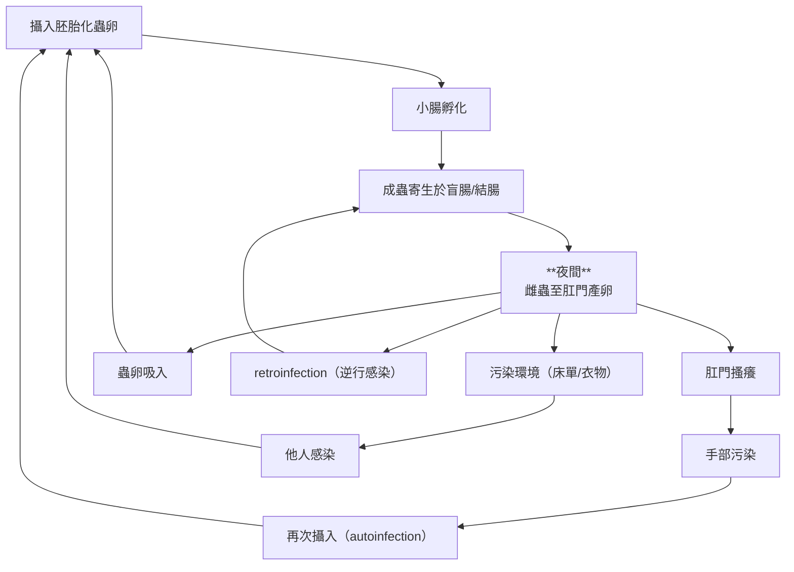
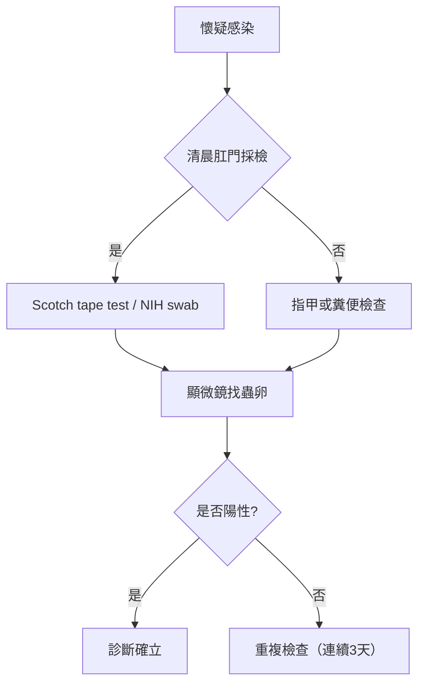

## Enterobius vermicularis（蟯蟲）總整理

---

### 一、基本重點表

| 類別 | 內容 |
|---|---|
| 學名 | *Enterobius vermicularis* |
| 常見名稱 | pinworm / threadworm |
| 自然宿主 | 人（human only） |
| 切片外觀 | 少肌型（meromyrian type）、具cervival alae(體表處有一小spine) |
| 感染期 | Embryonated eggs（胚胎化蟲卵） |
| 感染方式 | 糞口傳播、自體感染（autoinfection, exogenous autoinfection）、吃/吸入蟲卵、逆行性感染（retroinfection, endogenous autoinfection） |
| 好發族群 | 學齡兒童（免疫力不成熟，處在環境人口密度高） |
| 促進感染因子 | 擁擠、衛生差、集體生活（學校、托兒所） |
| 主要症狀 | 肛門搔癢（夜間）、睡眠干擾 |
| 可能併發症 | 陰道炎、輸卵管炎、appendicitis（少見） |
| 診斷 | Scotch tape test（首選）、NIH swab |
| 治療 | Albendazole / Mebendazole / Pyrantel pamoate |
| 預防 | 手部衛生、環境清潔、全家同步治療 |

---

### 二、形態分類表

| 項目 | 雄蟲 Male | 雌蟲 Female | 蟲卵 Ova |
|---|---|---|---|
| 大小 | 約 2–5 mm | 約 8–13 mm | 約 50–60 × 20–30 μm |
| 外形 | 白色、細小 | 白色、尾端細長 | 一側扁平（plano-convex） |
| 尾端 | 彎曲 | 尖直（pin-like） | — |
| 特徵 | 單一交尾刺（copulatory spicule） | 頸翼（cervical alae）、食道球（double bulb esophagus） 明顯 | 薄殼、不對稱 |
| 其他構造 | cervical alae、double bulb esophagus | 同左 | 診斷最重要 |

---

### 三、生活史流程圖

---

### 四、臨床表現分類

| 臨床面向 | 內容 |
|---|---|
| 常見族群 | 兒童 |
| 無症狀比例 | 約 1/3 無症狀 |
| 局部症狀 | 肛門搔癢（pruritus ani）、抓破皮膚 |
| 睡眠影響 | 夜間活動 → 睡眠干擾 |
| 泌尿/生殖道 | 夜尿 (nocturnal enuresis)、陰道刺激 |
| 上行感染 | 盆腔腹膜（chronic pelvic peritonitis）、子宮、輸卵管 (chronic salpingitis) |
| 其他併發症 | 闌尾炎（appendicitis）、UTI（少見） |

---

### 五、診斷流程圖

---

### 六、治療與預防

| 類別 | 內容 |
|---|---|
| Albendazole | 400 mg 單次 |
| Mebendazole | 100 mg 單次 |
| Pyrantel pamoate | 11 mg/kg 單次（max 1 g） |
| 重點 | **2 週後需重複一次** |
| 家庭處理 | 建議全家同步治療 |
| 預防 1 | 勤洗手 |
| 預防 2 | 指甲清潔 |
| 預防 3 | 清洗床單衣物 |

---

### 七、考點整理

- 感染型態：**embryonated egg**
- 特徵：**planoconvex egg（扁一側）**
- 診斷：**Scotch tape test（不是糞便檢查）**
- 症狀：**夜間肛門癢**
- 關鍵機制：**autoinfection + retroinfection**